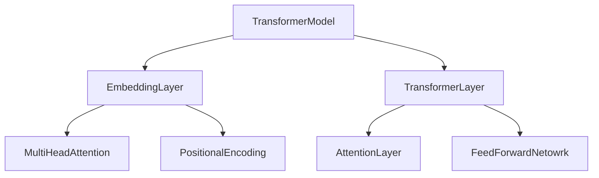
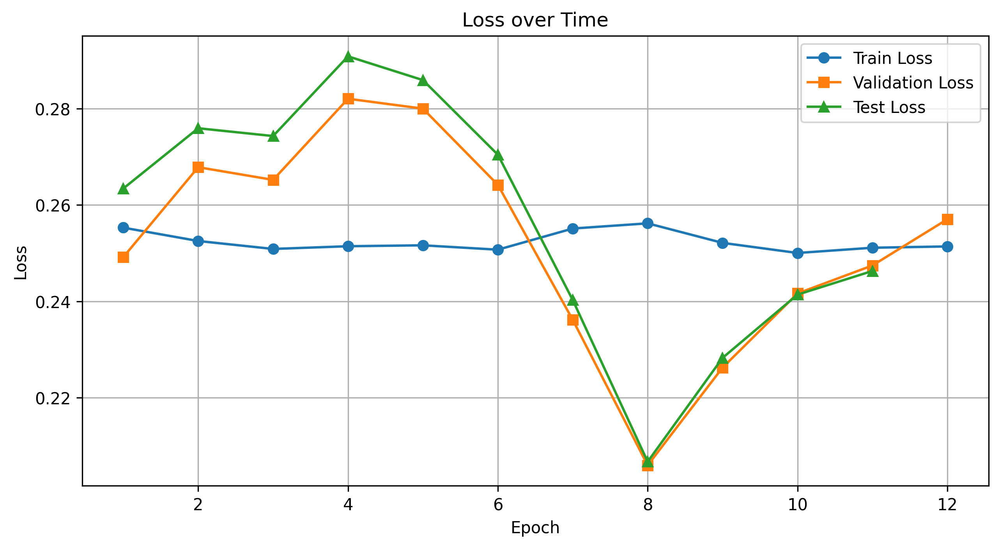

# The Transformer




# TransformerArchitecture
1. Embedding Layer 
   1. Embedding
   2. Positional Encoding
2. Transformer Layer
   1. Attention
   2. Feed Forward Network

To keep things simple, only one transformer layer was used: modern GPT networks typically have dozens of such layers stacked on top of one another.

## Embedding
* Word2Vec represents words as vectors in a similarity space, capturing semantic meaning based on context within some corpus.
* The embedding corpus in this case comes from Wikipedia (enwiki_20180420_100d.txt)
* The dimensionality of the input space is 100

## Positional Encoding
* Aboluste sinusoidal encoding was chosen.
* As I am not a fan of conflating the data with the positional encoding, the position was used to augment the embedding space.

## Attention
* In a Transformer model, the first layer weight matrix (the first self-attention layer) transforms the input embeddings (e.g., from Word2Vec) by applying linear projections followed by self-attention. Thus, a word “apple” has an embedding $ x \in \mathbb{R}^{d} $, where $d$ is the embedding dimension.
* Transformers modify embeddings based on sentence context (e.g., “apple” in “I ate an apple” vs. “Apple Inc. is a tech company” will have different contextual embeddings), whereas Word2Vec gives fixed representations (e.g., “apple” always has the same embedding).
* Word2Vec encodes meaning based on co-occurrence statistics, while self-attention refines this by modulating embeddings dynamically based on actual sentence structure.
* Word2Vec embeddings lie in a space optimized for distributional similarity, while the Transformer projects them into a new space.

The self-attention mechanism used here is called MultiHeadSelfAttention. multiple heads allow attention to pay attention to four different things or locations within weight space. Self attention relies crucially on the notion of Q,K, and V vectors, which are matrix projections of the input embedding space. 

1. Keys Represent Encoded Memory
2. Queries Retrieve from Memory
3. Values are the actual memories

#### $$ \text{Attention} = \text{softmax} \left(\frac{Q K^T}{\sqrt{d_h}}\right) V = AV$$
#### $$ Q=W^Qx, K=W^Kx, V=W^Vx $$
Where:
* A is the transition probability matrix, governing how information flows between tokens.
* QK^T captures pairwise attention relationships in the input (or context window).
* Softmax ensures probabilities sum to 1, making attention function as a probabilistic transition process.

Having multiple attention heads allows the model to maintain and retrieve different types of information simultaneously. 
Each head may store and retrieve different aspects of the sequence (e.g., syntactic relationships, semantic meaning), effectively increasing the short-term memory capacity.

**Short-Term Memory Analogy**

* The keys function like a dynamically updated short-term memory that holds a contextualized representation of tokens in a sequence.
* Since attention mechanisms operate within a fixed-length context window, the stored key representations serve as a temporary memory buffer that helps the model decide which past information is most relevant to the current token.
* Unlike long-term memory (e.g. which is stored in the network weights), this short-term memory is refreshed for each new input.

**Connectionist Analogy**

In a connectionist network, knowledge is stored in the weights of connections between neurons, which dictate how activation flows between units. These weights can be interpreted as transition probabilities, determining how likely it is that activation moves from one state (or neuron) to another. In the multi-head attention mechanism of transformers, the attention matrix (A) plays a similar role by dynamically encoding how strongly different elements (tokens or states) influence each other.

The Attention matrix (A) in a transformer attention mechanism is similar to how connectionist network models bidirectional connections. By computing dynamic attention scores via QK^T and normalizing them into a short-term attention matrix A, transformers generalize and improve upon connectionist models by enabling asymmetric associations (in virtue of separate Q an K matrices) and allowing context-aware transitions between states in a sequence.

## Feedforward Network
The output of the embedding is typically transformed with multiple feedforward layers: here, only one layer is used. 
The operation of the feedforward neural network (FFN) can be written:

$$ y = \text{ReLU}(x W_1 + b_1) W_2 + b_2 $$

where:
* x and y are the input and output, respectively.
* W_1, W_2 are learned weights.
* b_1, b_2 are biases.

This network layer is just a MultiLinearPerceptron with an ReLU activation function, with an added linear output layer.

## Implementation Details
```
Training Data       = Rotten Tomatoes dataset
Target Labels       = {0,1}
Error               = MSE
Embedding dimension = 100
Number of epochs    = 100
Learning Rate       = 0.001 
Batch Size          = 100
Stopping Criterion  = 0.05 # stop training if the validation performance increases by this amount.
```
# Results

```
 Epoch 12 of 100
 Train Loss: 0.2514
 Validation Loss: 0.2570
 Test Loss: 0.2463
 Training stopped due to overfitting.
```

|                 | precision | recall | f1-score | support |
|-----------------|-----------|--------|----------|---------|
|Negative Review  | 0.54      | 0.53   | 0.53     | 533     |
|Positive Review  | 0.54      | 0.55   | 0.54     | 533     |
|       accuracy  |           |        | 0.54     | 1066    |
|      macro avg  | 0.54      | 0.54   | 0.54     | 1066    |
|   weighted avg  | 0.54      | 0.54   | 0.54     | 1066    |



# Discussion

Training a transformer from scratch, as opposed to using a GPT (Generative Pre-trained Transformer), is probably not a great solution to this prediction problem. Transformers generally rely on vast amounts of data, and the rotten tomatoes dataset is not large.

In order to prevent that overfit, the dataset contains a validation set. Using performance on that subset as a stopping criterion helped somewhat, but it also prevents training from happening for very long. My feeling is that a larger and more varied dataset would help greatly, and if I have time, I will try reducing some of the complexity of the network to see if I can prevent overtraining, which might allow the network to train for a longer period of time without over-parameterizing.


